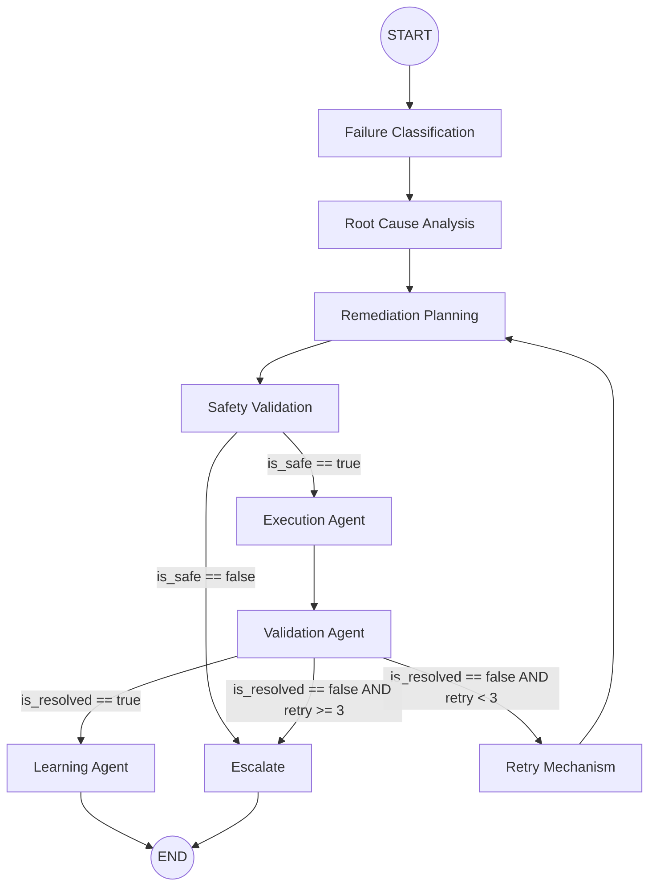

# Workflow Diagram

```mermaid
graph TD
    START((START)) --> classify[Failure Classification]
    classify --> rca[Root Cause Analysis]
    rca --> plan[Remediation Planning]
    plan --> safety[Safety Validation]
    
    safety -- is_safe == true --> execute[Execution Agent]
    safety -- is_safe == false --> escalate[Escalate]
    
    execute --> validate[Validation Agent]
    
    validate -- is_resolved == true --> learn[Learning Agent]
    validate -- is_resolved == false AND retry < 3 --> retry[Retry Mechanism]
    validate -- is_resolved == false AND retry >= 3 --> escalate
    
    retry --> plan
    learn --> END((END))
    escalate --> END
```
